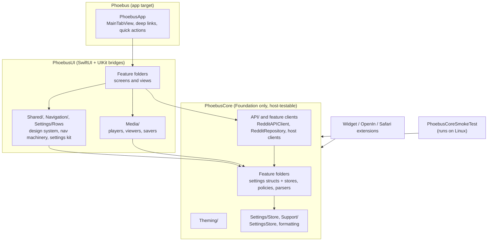
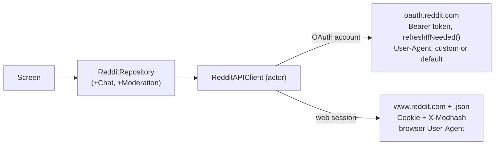
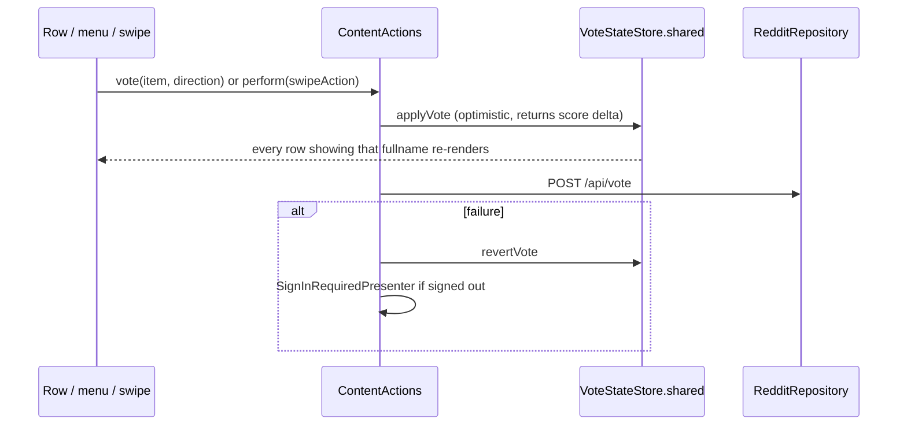
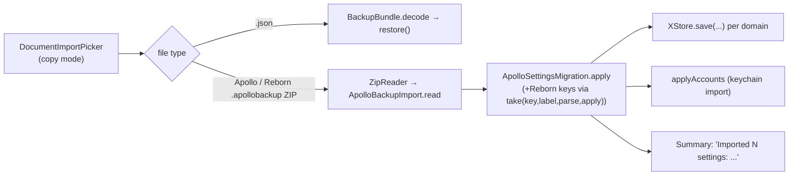

# Component reference

One entry per notable sub-component of the app: what Apollo / Apollo
Reborn feature it reproduces, where it lives, what it depends on, and
where it knowingly differs from the real app. Read this before the
source. Files are under `Sources/` unless stated. "UI" = `PhoebusUI`,
"Core" = `PhoebusCore`; both are grouped by feature, so a file's folder
follows its row's area (for example `UI/Feed/Rows/PostRow.swift`).

Companion docs: [gestures.md](gestures.md) (swipe internals) and
[intentional-differences.md](intentional-differences.md).

## Contents

- [Architecture at a glance](#architecture-at-a-glance)
- [Key flows](#key-flows): launch and auth, a request, a vote, a page swipe, a backup import
- Component tables: [1 shell](#1-app-shell-and-navigation), [2 feeds](#2-feeds-and-subreddits), [3 comments](#3-post-detail-and-comments), [4 media](#4-media-viewers-and-services), [5 social](#5-social-inbox-chat-modmail-moderation-profile-auth), [6 settings](#6-settings), [7 extensions](#7-extensions-and-shared)
- [Settings each area reads](#settings-each-area-reads)
- [Persistence map](#persistence-map)
- [Notification bus](#notification-bus)
- [Recipes](#recipes): add a setting, a settings screen, a pushing screen, a swipe action, a Reborn import key
- [Pitfalls index](#pitfalls-index)
- [Intentional differences](#intentional-differences-from-the-real-app)

## Architecture at a glance



Rules that follow from this shape:

- Anything expressible without UIKit (thresholds, parsers, gates,
  layout constants) belongs in `PhoebusCore` so the smoke suite can
  assert it on Linux. `PhoebusUI` types should be thin shells.
- Screens talk to Reddit only through `RedditRepository`. Nothing in
  `PhoebusUI` builds a `URLRequest` for reddit.com directly.
- Extensions depend on `PhoebusCore` only, and share data through the
  App Group container (`SharedFeedCache.appGroupID`), never
  `UserDefaults(suiteName:)` (silently nil under a free sideload).

## Key flows

### Launch and auth

```mermaid
sequenceDiagram
    participant App as PhoebusApp
    participant AS as AccountStore
    participant Auth as RedditAuthClient
    participant Tabs as MainTabView
    App->>AS: load accounts (keychain; file fallback in the simulator)
    alt no account
        App->>App: LoginScreen (OAuth or Universal OAuth web view)
        App->>Auth: exchange code, store credential
    end
    App->>Tabs: five NavigationStacks (Posts, Inbox, Profile, Search, Settings)
    Tabs->>Tabs: restore LastViewedSubredditStore destination
    Tabs->>Auth: /api/v1/me for Profile tab title and avatar
```

- Credentials: `KeychainCredentialStore`; the iOS simulator's keychain
  fails with -34018, so a container-local file stands in there.
- Web-session sign-in (chat, modmail, API-key-free accounts) swaps the
  transport, not the call sites: see "A request" below.

### A request



- `RedditAPIClient.baseURLOverride` exists only for pointing the app at
  a local mock server; nothing in the shipping app sets it.
- Decoders are lenient per item where Reddit is inconsistent
  (multireddits, flair richtext); a failed page keeps the list already
  on screen rather than blanking it.

### A vote (or save, or hide)



- Tapping the active direction toggles back to 0
  (`VoteStateStore.toggledDirection`).
- Save with Upvote on Save also upvotes. Hide removes the row through
  the caller's `SwipeActionHooks.onHide`.
- Do not keep a private `@State` copy of vote or save state anywhere;
  read `VoteStateStore` so the action bar, menus and rows agree.

### A page swipe (back or forward)

```mermaid
sequenceDiagram
    participant User
    participant PSC as PageSwipeController
    participant Nav as UINavigationController
    participant Fwd as ForwardNavigationStore
    User->>PSC: pan (PushPopGesturePolicy, arbiter, scroll exclusivity)
    PSC->>Nav: stand in as delegate; lock scroll views
    alt back
        PSC->>Nav: popViewController(animated: true)
        Nav->>Fwd: pushes the popped route to forward history
    else forward
        PSC->>Fwd: goForward() (re-push last entry)
    end
    PSC->>Nav: PageSwipeAnimator + interactive progress follows the finger
    alt commit
        Nav->>Nav: finish the transition
    else cancel
        Nav->>Nav: animate back, nothing changes
    end
    PSC->>Nav: hand the delegate back to SwiftUI
```

- A pushing screen must call `.apolloTracksForwardNavigation($binding)`
  or the forward swipe silently does nothing there.
- Tab changes clear forward history.
- Row swipes vs page swipes vs scrolling are arbitrated per sample
  (`ScrollGestureExclusivity`, `SwipeGestureArbiter`); details in
  [gestures.md](gestures.md).

### A backup import



- Keys deliberately skipped are listed in
  `ApolloSettingsMigration.isExcluded` and
  `ApolloSettingsMigration.notImported` (for example
  `ApolloRebornCustomThemes`), each with a one-line reason.

## 1. App shell and navigation

| Component | Files | What it is | Notes |
|---|---|---|---|
| App entry | `Phoebus/PhoebusApp.swift` | `@main`; shows `LoginScreen` or `MainTabView`; five root `NavigationStack`s (Posts, Inbox, Profile, Search, Settings); `phoebus://` and `apollo://` deep links (`DeepLinkDestination`, `PostLinkLoader`, `MultiredditLinkLoader`); home-screen quick actions | Profile tab title is the username; icon is the avatar (`ProfileTabAvatar`) |
| Notices | UI `ApolloToast`, `RedditRateLimitNotice`; Core `RedditRateLimitHold` | Top-of-screen error toasts; the API-Key-Free rate-limit notice (Reborn #1220/#1225) | |
| Tab bar | UI `LiquidGlassTabBar` | Native `TabView` with iOS 26 `tabBarMinimizeBehavior`; `HideHeaderOnScrollModifier` (Reborn `HideTopBarOnScroll`); hide style Left/Right/Fade/Down via `TabBarHideStyleProbe`; iPad bottom bar (`IPadTabBarBottom`, Reborn #387) | The real `UITabBar` supplies insets |
| Tab re-tap | UI `TabReselectionModifier` | Posts re-tap: scroll to top then pop one (#1153); Search re-tap: scroll to top then focus field (#1190); Settings: pop to root | UIKit's own pop-to-root is vetoed in the delegate |
| Page swipes | UI `PageSwipeNavigation`, `InteractiveSwipeNavigationModifier`, `ForwardNavigation`, `ScrollGestureExclusivity`; Core `PushPopGesturePolicy`, `NavigationGestureSettings` | Apollo's back/forward page swipes as a real interactive `UINavigationController` transition; forward history per tab | Design in [gestures.md](gestures.md). Settings tab is path-driven (`SettingsNavigation`) so it gets the same swipes |
| Row swipes | UI `SwipeActionsModifier`; Core `SwipeAction`, `SwipeCommitPolicy` | Configurable short/long swipe per screen (Posts, Comments, Inbox), raw `UIGestureRecognizer`, per-sample row/page arbitration | Vote/save/hide all route through `ContentActions` |
| Quick switch | UI `QuickSwitchGesture` | Apollo's two-finger theme quick switch | |
| Glass | UI `ApolloGlass`, `GlassSearchField`, `NavigationActionsPill`, `CenterTitleBetweenButtons` | Liquid Glass surfaces gated on `LiquidGlass.isEnabled && canRenderGlass`; glass search field shared by Search, Subreddit Search and the Jump Bar; Reborn 3.7.0 collapsed nav action pill; Reborn 3.7.1 centred titles | Glass only renders on a device; the iOS simulator cannot draw it |
| Compatibility | UI `Compatibility` | Every `*IfAvailable` shim for iOS 18/26 API; min iOS 17 | the iOS 17 deployment target enforces it |
| App lock | UI `AppLockGate`, `OrientationLock`; Core `AppLockSettings` | Face ID/passcode lock with grace period; Portrait Lock | |
| Theming | UI `ThemeAppearance`, `ScaledFont`, `Color+Hex`; Core `Theme`, `ThemeCompiler`, `ThemeGallery*`, `ApolloPalette`, `ThemeAutoSwitch*`, `SolarTimes` | Compiled theme tokens applied to UIKit appearance; Apollo's point sizes that follow Dynamic Type (`apolloFont`); auto-switch by time or NOAA sunset (`SunsetLocator`) | Reborn's HCT palette engine is approximated |
| Link routing | Core `LinkRouter`, `RedditURLTarget`, `ShareLink*`, `ExternalBrowser`, `SafariDarkLoadingPolicy`; UI `InAppSafariView` | Which Reddit URLs open natively, share-link normalisation, external browser choice, in-app Safari | |
| Sign-in prompts | UI `SignInRequiredPresenter`; Core `SignInRequiredCopy` | Apollo's "Sign In to X" alerts | |
| Icons | UI `StockIcon`, `AppIconArtwork`, `LiquidGlassIconCards`; Core `ApolloMenuIcon`, `AppIconOption`, `LiquidGlassIcon*` | Apollo's vector glyphs (`Resources/StockIcons`), app icon picker incl. Liquid Glass packs | |
| Menus | UI `ApolloActionSheet`, `ApolloUIKitMenuButton`; Core `ApolloMenuSectioning`, `ActionMenuLayout`; UI `ActionMenusSettingsScreen` | Apollo's bottom action sheet; real `UIMenu` hosted in SwiftUI; Reborn Action Menus (#1131): each ••• menu is a list of id-keyed rows passed through `ActionMenuLayoutStore.arrange(_:for:)` | Rows not in Reborn's catalogue ride with the catalogued row before them |

## 2. Feeds and subreddits

| Component | Files | What it is | Notes |
|---|---|---|---|
| Feed | UI `FeedScreen` (+ `FeedScreen+Menus`, `+Header`, `+Loading`), `FeedListingModel` (posts, paging, load state) | Subreddit/multi/home/popular/all listing: sorts, compact/large rows, jump bar, inline "Search" row, Gallery View entry, community highlights, "+N new" tracking, reached-end cell | Largest screen. `FeedSnapshotCache` keeps one-time fetches across pushes |
| Post row | UI `PostRow` (+ `PostRow+Compact`, `+Large`), `TitleFlairLayout`, `TitleTranslation`, `SavedIndicatorBadge`, `RowHighlight`, `PostSwipePresenters` | Apollo's post cell: title + link flair as one text run, media, info row, saved wedge, press highlight (#1166), title translation | Metrics follow Apollo's own cell; see comments in `PostRow` |
| Media posts | UI `PostMediaView`, `InlineMediaBodyView`, `MutedVideoPlayerView`, `AnimatedGIFView`, `CachedAsyncImage`, `GalleryPager`, `ImgurAlbumView`, `SteamLinkView`, `LinkPreviewCard`, `PollView`, `DevvitWebView`, `YouTubePlayerView`, `VimeoPlayerView` | Dispatch by URL class; muted autoplay video with scrub/hold-speed/PiP; GIFs via AnimatedImage; galleries; Imgur albums; tweets; Steam; rich link previews; polls; Devvit | Autoplay policy in Core `AutoplayPolicy`/`VideoAutoplayPolicy`. Numeric-title link cards fall back to the site name |
| Feed gallery gestures | UI `FeedGalleryPanYield`; Core `FeedGalleryPanPolicy` | "Swipe Past Gallery to Navigate" (Reborn #1271): a pan past the first/last image goes to the row's swipes | Gate recognizer on the TabView's paging scroll view |
| Subreddits root | UI `SubredditsRootScreen`; Core `FavoriteSubredditsStore`, `SubredditIndexTitle`, `SubredditCapitalization`, `HiddenModeratorSubreddits`, `FollowedUsersOrderStore` | Favourites (ordered), A-Z with index scrubber, multireddits, Following section, moderated subs, custom sections; filter field as first row; edit mode | Multireddit fetch retries once and keeps the last list on failure |
| Subscription sync | Core `SubscriptionChange` (+ `.apolloSubscriptionsChanged`), `SubscribedSubredditsCache` | One notification for every subscribe/unsubscribe, so the header pill, menus and the list agree (Reborn #1264) | Posted by `RedditRepository.subscribe` |
| Subreddit header | UI `FeedScreen` + `SubredditIconView`, `SubredditCustomArtStore`, `ApolloSubredditSectionHeader` | Icon, banner, subscribe, Flair/Sidebar buttons; custom local banner/icon (#266) | |
| Sidebar, rules, mods | UI `SubredditSidebarScreen`, `SubredditRulesScreen`, `SubredditModeratorsScreen`, `SubredditNotificationsSheet` | Sidebar markdown, rules, public mod list (with avatars behind Show User Avatars), per-sub watcher notifications | |
| Multireddits | UI `MultiredditListScreen`, `MultiredditEditSheet`, `MultiredditSubredditsScreen`, `AddToMultiredditSheet`; Core `RedditMultireddit` | List, create/edit, add/remove subs, custom icons (#799) | |
| Search | UI `SubredditSearchScreen`, `PostSearchScreen`, `JumpBarField` | Subreddit search/subscribe, post search, nav-title jump bar | |
| Google search | UI `GoogleSearchResultsView`; Core `GoogleSearch` | Reborn's "Search with Google" for Reddit results, from the search screen | Pure parts (query, URL, result parsing) in Core |
| Gallery View | UI `GalleryViewScreen`, `GalleryImageViewerScreen`; UI `WaterfallGrid`; UI `GalleryTileAutoplay`; Core `GalleryTile`, `GalleryPostMedia`, `GalleryAutoplaySettings`, `GalleryMuteStore` | Reborn's waterfall photo grid with tile autoplay (12-tile cap), fullscreen pager with hold-and-drag scrub and swipe-to-dismiss | |
| Filters | Core `ContentFilter`, `PostFilterRules`, `TagFilterSettings`, `RESFilterImporter` | Keyword/user/subreddit/flair filters, Reborn Post Filters and Tag Filters, RES filter import | |
| Read/recent | Core `ReadPostStore`, `RecentlyReadStore`, `RecentEntryPolicy`, `NewCommentsTracker`; UI `RecentlyReadScreen`, `HiddenPostsScreen` | Mark read / auto hide (incl. Popular and All), Recently Read, "N new comments" badge, Hidden Posts | |
| Community Highlights | UI `CommunityHighlightsCarousel`, `CommunityHighlightsWebFetch`; Core `CommunityHighlights`, `HighlightsCollapseStore` | Reborn 3.7.0 carousel; full mode scrapes up to 6 via a hidden web view | |
| Pagination | Core `FeedPaginationPolicy`, `PostSortMemoryStore`, `PostSizeMemoryStore`, `LastViewedSubredditStore` | Page-ahead threshold, remembered sort/size per sub, last viewed sub | |

## 3. Post detail and comments

| Component | Files | What it is | Notes |
|---|---|---|---|
| Post detail | UI `PostDetailScreen`, `PostDetailHeader` | Header (media-first for image/video/gallery posts, title, flair, body, info row, action bar), comment list, find-in-comments, jump-to-next-comment button, AI summary card, sort, floating post tabs | |
| Comment tree | UI `CommentTreeScreen`, `CommentTreeStore` (`insertPosted`, Reborn #1196 fade-in); Core `CommentTree`, `PostedCommentResponse`, `CommentSortMemoryStore` | Tree build, collapse, `more` loading, depth colours, linked-comment context (`?context=`), sort memory (Live Update never persisted) | `rowGeneration` re-ids a toggled row so the List reloads it |
| Comment row | UI `CommentRow`, `CommentFlairPill`, `MoreRepliesRow`, `DeletedReasonChip`, `AccountAgeBadge`, `TimestampLabel` | Apollo's comment cell with Reborn metrics (15pt root, 12pt/depth bars), flair richtext, pinned/locked byline, deleted-comment reason chip and red tint, new-account highlight, tap-timestamp-for-date | |
| Collapse animation | UI `CommentCollapseAnimation` | Swizzles the List layout so collapse/expand animate like Apollo (header rises, replies fan/fade) | Expanding about 26 or more rows at once snaps (SwiftUI `List` limit) |
| Voting/actions | UI `ContentActions`, `PostVoting`, `CommentVoting`; Core `VoteStateStore`, `Votable`, `VoteBreakdownCalculator`; UI `VoteBreakdownView` | The one optimistic vote/save/hide path; Upvote on Save; Reborn vote-count estimate | All screens' swipe handlers use `ContentActions.perform` |
| Composer | UI `CommentComposerScreen`, `ComposePostScreen`, `CrosspostScreen`; UI `MarkdownComposerField`, `QuickBarToolbar`, `GiphyPickerScreen`; Core `NativeCommentImages`, `TextFaces`, `SpongeText` | Apollo's comment/post composers with Quick Bar, Giphy 8th button, text faces, native image comments (RTJSON) | Poll compose in `PollComposeService` |
| Body rendering | UI `LongBodyText`, `BulkTranslatedText`; UI `SpoilerGatedBody`; Core `RedditMarkdown`, `MarkdownBodyCleanup`, `BodyParagraphs` | Chunked long bodies, Reddit markdown, fancy-pants cleanup (#405), spoiler gating, bulk translation | |
| Find in comments | UI `FindInCommentsBar`, `FindInCommentsFieldRow`; Core `CommentSearchEngine` | Reborn glass find: pinned field, n/m, ^ v pill | |
| Deleted comments | Core `DeletedCommentsSettings`, `ArcticShiftClient`; UI `DeletedCommentsSettingsScreen`, `DeletedMoreCommentsExplanationScreen` | Reborn recovery via Arctic Shift; reason from Reddit's current body | |
| AI summaries | UI `AISummaryCardView`; Core `AISummaryCard`, `ApolloAIClient`, `OnDeviceSummarizer`, `AIModelCatalog`, `AIArticleDetector` | Apollo AI card, Tap to Summarize, provider/model catalogue, on-device summariser | |
| Share as image | UI `ShareAsImageScreen`, `ShareCardView`; UI `ShareCardImageLoader`; Core `ShareCardFormatting` | Apollo's share card | |
| Comment insights | UI `CommentVoteInsightsSheet`; Core `CommentVoteInsightsClient` | Reborn author-only insights | |
| Floating post tabs | UI `FloatingPostTabsManager`, `FloatingPostTabsOverlay`; Core `FloatingPostTabsSettings` | Reborn floating tabs | |
| Misc | UI `RemindMeScreen`, `ReportSheet`, `SelectTextSheet`, `TranslatorScreen`, `TextFacesPickerScreen`, `AllSubredditCommentsScreen`; Core `RemindMeScheduler`, `TranslatorURLBuilder`, `MutedThreadsStore`, `FollowThreadActivity` | Remind Me (local notifications, not push), report, select text, translator, all-comments feed, muted threads, Follow Thread Live Activity | |

## 4. Media viewers and services

| Component | Files | What it is | Notes |
|---|---|---|---|
| Fullscreen pager | UI `MediaPagerScreen`, `FullscreenImageViewer`, `VideoControlPanel`, `AVPlayerLayerView`, `VideoPlayerCache`, `LiveTextImageView`, `VideoDeblurinator`; Core `VideoControlPanelTimeLabel`, `VideoHoldSpeedSettings`, `VideoPlaybackSpeeds`, `FeedVideoScrubberSettings` | Apollo's fullscreen media viewer: shared chrome, control panel, Live Text, deblurinator, hold-for-speed, swipe up for comments | Reddit-hosted video needs a device; the iOS simulator cannot decode it |
| Floating PiP | UI `FloatingPiP`; Core `PictureInPictureSettings`; UI `PictureInPictureSettingsScreen` | Reborn in-app PiP: hand-off on scroll-away, drag/fling/pinch, controls, positions | |
| Saving | UI `PhotoAlbumSaver`, `AlbumImageSaver`, `GIFSaveService`, `SaveAllMediaJob`, `VideoDownloadService`, `ShareVideoExportService`; Core `AlbumSaveCapacity`, `SaveAllMediaSummary`, `VideoDownloader` | Save to "Apollo" album, Save GIFs as…, Save All Media (#1048), Download Video, Share as Video (#380) | |
| Image menu | UI `PressAnchoredImageMenu` | Long-press image menu anchored at the press point | |
| Hosts | Core `RedGifsClient`, `ImgurClient`, `ImgChestClient`, `GiphyClient`, `StreamableClient`, `VimeoURLParser`, `ImgflipURLParser`, `YouTubeURLParser`, `SteamURLParser`, `TweetClient`, `OpenGraphClient`, `LinkPreviewCache`, `SportsClipHost`, `RedditVideoStream`, `RedditMediaUploadClient` | Third-party media resolution and uploads | |
| Inline media | Core `InlineMediaDetector`, `InlineMediaSettings`, `LinkPreviewSettings`, `DevvitPostDetector` | Reborn inline media in bodies, rich link previews, Devvit detection | |
| Avatars | UI `AvatarView`, `ProfileTabAvatar`; Core `AvatarCache`, `AccountAgeCache` | Circular/rounded avatars per Shared Profile Picture Shape (#1136), cached | |
| Audio | Core `VideoAudioSession`; UI `Haptics` | Audio session hand-over, haptics matching Apollo's | |
| Feed video sound | UI `FeedVideoSound` | Only one feed video audible at a time (Reborn #1250) | |
| Archive | UI `ArchiveImageTombstone` | Reborn "image removed" check for Hidden & Deleted media | |

## 5. Social: inbox, chat, modmail, moderation, profile, auth

| Component | Files | What it is | Notes |
|---|---|---|---|
| Auth | UI `LoginScreen`, `WebSessionLoginScreen`, `SignInTroubleshootingScreen`; `UI/Accounts/OAuth/*`; Core `RedditAuthClient`, `AccountStore`, `CredentialStore`, `WebSessionCredential`, `WebSessionRegistry`, `CustomAPISettings` | Installed-client OAuth, Reborn Universal OAuth Sign-In (in-app web view), web-session login for chat/modmail, multi-account, keychain with a file fallback in the simulator | Never uses Apollo's real client ID |
| Accounts | UI `AccountManagerScreen`, `AccountsAPIKeysScreen`, `CustomAPISettingsScreen`, `APIKeySetupGuideScreen`; `UI/Accounts/Manager/AccountManager.swift` | Reborn account switcher (#1077), Accounts & API Keys, Custom API | One app-wide API key; no per-account key editor |
| Session expiry | Core `RedditAuthClient` (`TokenRefreshOutcome`, `isSessionExpired`), `RedditAPIClient.send`; `MainTabView` alert | Reborn #1200: a 401 refreshes once and retries; a revoked refresh token prompts to sign in again | Posts `apolloSessionExpired` |
| Networking | Core `RedditAPIClient`, `RedditRepository` (+Chat, +Moderation), `RedditModels`, `RedditThing`, `RedditMessage` | The facade every screen calls; lenient decoders | |
| Inbox | UI `InboxListScreen`, `InboxScreen`, `ComposeMessageScreen`; Core `InboxCategory` | Boxes menu, category lists, compose (subject capped at 100 for PMs) | Inbox comment taps open the linked comment with context |
| Chat | UI `ChatListScreen`; UI `MessageBubbleRow`; Core `MessageDraftStore` (Reborn #1207 drafts, Keychain), `RedditChatClient`, `ChatLiveSync` (long-poll `/sync`, merged room state; UI owner `ChatLive`), `RedditChatReactions`, `ChatSendQueue`, `ChatDateFormatter`, `ChatMessagesFilter`, `ChatUnreadNotifier`; UI `ChatBarkNotifier` | Native Reddit Chat via web session: list, threads, reactions, send queue, filters, Bark unread notifications (fed by `InboxBadge`'s poll) | See `docs/chat-sending-and-threads.md` |
| Modmail | UI `ModmailListScreen`; Core `ModmailWebService`, `ModmailConversation`, `ModmailWebConversation` | Modmail via web session | See `docs/modmail-web-session.md` |
| Mod tools | UI `ModQueueScreen`, `ModeratorLogScreen`, `ModeratorUsersScreen`, `ModeratorInviteScreen`, `AutoModeratorScreen`, `SubredditTrafficScreen`; Core `ModQueueItem`, `ModeratorLogEntry`, `ModeratorListedUser`, `ModeratorUserList`, `RedditRemovalReason`, `RemovalNotifyKind`, `SubredditTraffic` | Queue (approve/remove/spam/ignore reports), removal reasons with Apollo's "Notify user via…" step (Public Sticky, Reborn's from-Subreddit #515, Mod Mail from Subreddit/You, private mod note), log, banned/muted users, invites, AutoMod config, traffic | Comment-row mod actions in `CommentRow` remove without the reason flow |
| Profile | UI `UserProfileScreen`, `ProfileListingView`, `HiddenContentScreen`; Core `ProfileLayoutSettings`, `IdentityHeaderLayout`, `ProfileBannerURL`, `RedditTrophy`, `BadgeBook`, `SavedCategory`, `SocialLinkService`, `HiddenContentFinder` | Immersive/Compact/Native layouts, banner viewer, badge book, saved categories, social links, Hidden & Deleted (#1137), "..." on own profile | |
| Notifications | UI `NotificationsSettingsScreen`, `NotificationBackendSettingsScreen`, `WatcherComposerScreen`, `PushNotificationCoordinator`; Core `PushNotificationClient`, `PushDeviceIdentity`, `PushRegistrationState`, `NotificationBackendSettings`, `NotificationSettings`, `SubredditWatchStore`, `TrendingSubredditTitleParser` | Self-hosted apollo-backend over APNs (when the signing has push) or Bark; watchers; the app icon badge | `PushNotificationCoordinator` sets the icon badge in the foreground, from a background refresh (`BGAppRefreshTask`, not available in the simulator), and APNs pushes carry it themselves; notification taps open the thread or inbox |

## 6. Settings

| Component | Files | What it is | Notes |
|---|---|---|---|
| Root and search | UI `SettingsScreen`, `SettingsSearchResultsList`; UI `SettingsSearchFieldRow`, `SettingsSearchRow`, `SettingsNavigation`, `SettingsNavigationRow`; Core `Settings/SettingsSearchIndex*` | Apollo's root table with Reborn hub row, searchable with scroll-to-and-flash, path-driven stack | Index is generated (`scripts/generate/`) |
| Row kit | UI `ApolloFlatList`, `SettingsRowMetrics`, `ApolloSettingsPicker`, `ApolloSettingsTextFieldRow`, `SettingsDetailToggle`, `SettingsPreviewCard`, `*PreviewMock`, `Setting` | Flat full-bleed lists (`apolloFlatListAppearance`, never `Form`), 32/32 row geometry, pickers, text-field rows, title+detail toggle (Reborn switch cell: 3pt gap, 11pt padding), preview cards, `@Setting` read/write | Never use `Form`; it ignores the list style on iOS 26 |
| Stock screens | UI `GeneralSettingsScreen`, `AppearanceSettingsScreen`, `ThemeSettingsScreen`, `CommentsThemeSettingsScreen`, `GestureSettingsScreen`, `FiltersSettingsScreen`, `MarkReadSettingsScreen`, `NotificationsSettingsScreen`, `SecuritySettingsScreen`, `PortraitLockSettingsScreen`, `ExternalBrowserSettingsScreen`, `AppIconSettingsScreen`, `AboutScreen`, `CacheExplainerScreen`, `AwardGiftingScreen` | Apollo's own settings tree, section for section, real `UserDefaults` keys so backups import | Defaults follow Apollo's registered defaults |
| Reborn hub | UI `ApolloRebornHubScreen` and every Reborn sub-screen (`InterfaceSettings`, `PostsFeedsSettings`, `CommentsSettings`, `MediaSettings`, `InlineMediaSettings`, `LinkPreviewSettings`, `PollsSettings`, `SubredditsSettings`, `SubredditLayout/Sections`, `ProfileLayout`, `InfoRow`, `Translation`, `ApolloAI`, `AIModelBrowser`, `PictureInPicture`, `DeletedComments`, `PostFilters`, `TagFilters`, `SavedCategories`, `OpenInApp`, `CustomSubredditSource`, `SettingsShortcuts`, `Wallpapers`, `BugReport`, `CrashReports`, `ClearTweakCaches`, `DeleteImgurUploads`, `WidgetSetup`, `BuyUsACoffee`) | Reborn's hub tree | `ApolloSettingsMigration+Reborn` lists which keys import |
| Themes | UI `ThemeGalleryScreen`, `ThemeGenerateScreen`, `ThemeQRCodeView`, `ThemeQRScanScreen`; Core `ThemeGenerationClient`, `ThemeQRCodePayload`, `ThemeGenerationSettings` | 50-theme gallery, AI generation, QR share/scan | |
| Backups | UI `BackupRestoreSettingsScreen`, `AutomaticBackupSettingsScreen`; UI `DocumentImportPicker`; Core `BackupBundle`, `ApolloBackupImport`, `ApolloKeychainImport`, `ApolloSettingsMigration(+Reborn)`, `AutomaticBackup*`, `ZipReader` | JSON backups, real Apollo/Reborn `.apollobackup` import (58 settings), automatic backups | Copy-mode document picker (`.fileImporter` did not work reliably) |
| Text size / black | `PhoebusUI/Support/*`; Core `AppearanceTextSizeStep`, `PureBlackSettings` | Use System Text Size, Pure/PURER black tiers | |

## 7. Extensions and shared

| Component | Files | What it is | Notes |
|---|---|---|---|
| Widgets | `PhoebusWidget/`; Core `WidgetFeedSource`, `WidgetKitShared`, `SharedFeedCache`, `CalendarPhotoPicker` | 7 intents, Live Activity, calendar/photo/headline/post/feed/shortcuts widgets | Configurable widgets need `Metadata.appintents` (macOS toolchain); see [widgets-and-signing.md](widgets-and-signing.md) |
| Share sheet | `PhoebusOpenIn/` | "Open in Apollo" action extension | |
| Safari | `PhoebusSafari/`, `SafariExtension/` | Web extension opening reddit links in the app; mode lives in its popup | |
| Shortcuts | `Phoebus/AppIntents.swift` | App Intents | |
| Support | Core `Support/RelativeTime`, `AbbreviatedCount`, `SettingsStore` | Apollo's time and count formatting; the settings layer (see "How settings work") | |
| Tests | `PhoebusCoreSmokeTest/main.swift` + `Checks/*.swift`, `scripts/smoke.sh` | Host-side checks on Core values; they call code and read only fixtures and assets, never source text | |

## Settings each area reads

`GeneralSettings` (one struct, `GeneralSettingsStore`) holds most
toggles. The properties that change behaviour, grouped by consumer:

| Area | `GeneralSettings` properties | Other stores |
|---|---|---|
| Tab bar and chrome | `hideBarsOnScroll`, `tabBarHideStyle`, `hideTopBarOnScroll`, `classicTabBarScrollBehavior`, `iconOnlyTabBar`, `hideUsernameOnTabBar`, `useProfileAvatarTabIcon`, `ipadTabBarBottom`, `tabBarSwipeNavigation`, `enableLiquidGlass`, `enableLiquidGlassTabBar`, `glassRenderOverride`, `centerTitleGapCentering`, `collapseNavigationActions`, `scrollReturnButton` | `HeaderStyleStore`, `SettingsShortcutsStore` |
| Feeds | `defaultRedditToLoad`, `rememberSubredditToLoad`, `postDisplayStyle`, `thumbnailsOnLeft`, `thumbnailSize`, `textPostThumbnailsEnabled`, `hideFeedDescriptions`, `defaultPostsSort`, `defaultPostsTimeSort`, `rememberPostsSortPerSubreddit`, `infiniteScrollingEnabled`, `excludeSubscribedFromAllPopular`, `showPostFlair`, `enableFlairColors`, `showAwards`, `threeDTouchMarksRead`, `devvitInteractivePosts`, `devvitFeedWidgets`, `forwardSwipeForgetAfterScrolling` | `SubredditLayoutSettingsStore`, `InfoRowSettingsStore`, `ContentFilterStore`, `TagFilterStore`, `ReadPostStore` settings |
| Subreddits list | `hidePopularInSubredditList`, `hideAllInSubredditList`, `hideModeratorInSubredditList`, `subredditFeedIconStyle`, `subredditFeedLayout`, `trendingSubredditsLimit` | `SubredditSectionsSettingsStore`, `FavoriteSubredditsStore` |
| Comments | `defaultCommentSort`, `rememberCommentsSortPerSubreddit`, `ignoreSuggestedSort`, `autoCollapseChildComments`, `autoCollapsePinnedComments`, `autoCollapseAutoModeratorComments`, `tapToCollapseType`, `showJumpButton`, `jumpButtonPosition`, `newCommentsHighlightifier`, `liveCommentsFollow`, `showUserFlair`, `showUserProfilePictures`, `highlightAccountAge`, `hideBlockedUserComments` | `CommentsThemeStore`, `DeletedCommentsSettingsStore`, `ApolloAISettingsStore`, `TranslationSettingsStore` |
| Actions | `upvoteOnSave`, `allowSaveCategories`, `hapticFeedbackEnabled`, `sharePostIncludesTitle`, `shareOldRedditLinks`, `shareLinkHost` | `SwipeActionStore`, `NavigationGestureSettingsStore` |
| Media | `autoplayMode`, `unmuteVideosWhenOpened`, `unmuteFeedVideosMode`, `unmuteCommentsVideosMode`, `loopVideosWithAudio`, `showMediaViewerControlsWhenOpened`, `videoDeblurinatorEnabled`, `liveTextAnalyzer`, `saveToApolloAlbum`, `gifSaveFormat`, `preferredGIFFallbackFormat`, `feedGalleryCarousel`, `feedGalleryEdgeSwipeNav`, `swipeUpForComments`, `nsfwBlurOverride`, `openVideosInYouTubeApp`, `pipEnabled`, `mediaUploadHost`, `proxyImgurViaDuckDuckGo`, `imgurAlbumFallbackProxies` | `InlineMediaSettingsStore`, `LinkPreviewSettingsStore`, `GalleryAutoplayStore`, `VideoHoldSpeedStore`, `FeedVideoScrubberStore`, `PictureInPictureSettingsStore` |
| Links | `openRedditLinksInApollo`, `openTwitterLinksIn`, `alwaysUseReaderMode`, `showRichLinkPreviews`, `linkPreviewStyle`, `commentLinkHost`, `commentLinkPreferNative` | `ExternalBrowserSettingsStore` |
| Inbox and polls | `unifyModmailInInbox`, `pollsEnabled`, `pollOptionAlignmentLeft` | `NotificationSettingsStore`, `NotificationBackendSettingsStore` |
| Device | `smartRotationLockEnabled` | `AppLockStore` (portrait lock), `AppearanceSettingsStore`, `PureBlackSettingsStore` |

## Persistence map

### How settings work (one layer)

Every setting goes through one **source** (`Core/Settings/Store/SettingsStore.swift`):

- `SettingsStore<Model>`: a Codable model as JSON under one key. Decode
  memoised by the stored bytes; lenient per field; optional one-shot
  `migrate` and write-through `mirror` hooks.
- `DefaultsKey<Value>`: one plain value under a stock Apollo/Reborn key
  (so backups import it).
- `CustomSettingsSource<Value>`: a value spanning several plain keys, or
  validated as it's read.

All three share `load`, `save` (whole value, for restores/imports) and
`update { $0.field = x }` (read-modify-write, the only write the UI
uses), and every save posts `.apolloSettingsChanged` with the key.
Each `XStore` enum exposes its source as `storage`; models with one
app-wide store adopt `StoredSettingsModel`.

**In views, use `@Setting` only** (`UI/Settings/Rows/Setting.swift`):

```swift
@Setting(GeneralSettings.self) private var general        // a model
@Setting(SwipeActionStore.storage(for: .posts)) private var swipes
Toggle("…", isOn: $general.showUserProfilePictures)      // writes one field
$general.update { $0.a = 1; $0.b = 2 }                   // several fields
```

The value is read-only; writes go through the projected handle. All
views naming a setting share one in-memory copy that refreshes on any
save (or a direct defaults write, e.g. a restore), so screens never
disagree and a read in `body` costs nothing. Never hold a `@State` copy
of a stored setting; `XStore.load()` remains fine in actions,
initializers and non-view code.

Keys are this app's own unless noted; real Apollo keys are only read
during backup import.

| Store | Key(s) | Screen that edits it |
|---|---|---|
| `GeneralSettingsStore` | `com.pendo324.Phoebus.generalSettings` | General, Posts & Feeds, Comments, Interface, Media, most Reborn toggles |
| `AppearanceSettingsStore` | `Phoebus.appearanceSettings` | Appearance (text size, fonts) |
| `ThemeStore`, `CommentsThemeStore` | `…selectedThemeID`, `…commentsThemePalette` | Themes, Comments Theme |
| `ThemeAutoSwitchSettingsStore`, `SunsetCoordinatesStore` | `…themeAutoSwitchSettings`, `SunsetCoordinates` | Themes > auto switch |
| `ThemeGenerationSettingsStore` | `…themeGenerationSettings` | Theme Generate |
| `PureBlackSettingsStore` | `…pureBlackSettings` | Appearance |
| `HeaderStyleStore` | `…headerStyle` | Interface |
| `AppIconStore` | `…selectedAppIcon` | App Icon |
| `AppLockStore` | `Phoebus.appLock`, `Phoebus.portraitLock` | Security, Portrait Lock |
| `NavigationGestureSettingsStore` | `…navigationGestureSettings` | Gestures |
| `SwipeActionStore` | per screen (`load(for:)`) | Gestures |
| `ContentFilterStore`, `TagFilterStore` | `…contentFilters`, `…tagFilterSettings` | Filters, Tag Filters |
| `InlineMediaSettingsStore`, `LinkPreviewSettingsStore` | `…inlineMediaSettings`, `…linkPreviewSettings` | Inline Media, Rich Link Previews |
| `GalleryAutoplayStore`, `GalleryMuteStore` | `Phoebus.galleryAutoplaySettings`, `ApolloGalleryVideosMuted` | Media |
| `VideoHoldSpeedStore`, `FeedVideoScrubberStore` | `Phoebus.videoHoldSpeedSettings`, `Phoebus.feedVideoScrubberSettings` | Media |
| `PictureInPictureSettingsStore` | `Phoebus.pictureInPictureSettings` | Picture in Picture |
| `InfoRowSettingsStore` | `…infoRowSettings` | Info Row |
| `FloatingPostTabsSettingsStore` | `…floatingPostTabsSettings` | Interface |
| `SubredditLayoutSettingsStore`, `SubredditSectionsSettingsStore` | `…subredditLayoutSettings`, `…subredditSectionsSettings` | Subreddit Layout / Sections |
| `ProfileLayoutSettingsStore` | `…profileLayoutSettings` | Profile Layout |
| `TranslationSettingsStore` | `…translationSettings` | Translation |
| `ApolloAISettingsStore` | `…apolloAISettings` | Apollo AI |
| `DeletedCommentsSettingsStore` | `…deletedCommentsSettings` | Deleted Comments |
| `ExternalBrowserSettingsStore` | `…externalBrowserSettings` | Open Links In |
| `CustomAPISettingsStore` | `…customAPISettings` | Custom API (also sets `RedditAPIClient.userAgentOverride`) |
| `CustomSubredditSourceStore` | `…customSubredditSources` | Custom Subreddit Sources |
| `NotificationSettingsStore`, `NotificationBackendSettingsStore` | `…notificationSettings`, `…notificationBackendSettings` | Notifications, Notification Backend |
| `SubredditWatchStore` | `…watchedSubreddits` | subreddit "•••" > Notifications |
| `SettingsShortcutsStore` | `SettingsTabShortcuts` | Settings Shortcuts |
| `ActionMenuLayoutStore` | `ActionMenuLayouts` (Reborn's key and shape) | Interface → Action Menus |
| `FavoriteSubredditsStore.confirmChanges` | `ConfirmFavoriteToggle` | Subreddits → Favorites |
| `ImgurUploadHistoryStore` | `…imgurUploadHistory` | Manage Uploads |

State (not settings), same mechanism:

| Store | Key | Holds |
|---|---|---|
| `FavoriteSubredditsStore` | ordered list + display casing | Subreddits favourites |
| `FollowedUsersOrderStore` | `FollowedUsersOrder` | Following section order |
| `HiddenModeratorSubredditsStore` | `…hiddenModeratorSubreddits` | moderated subs hidden from the list |
| `ExpandedMultiredditsStore` | `…expandedMultireddits` | expanded multireddit rows |
| `LastViewedSubredditStore` | `…lastViewedFeedDestination` | feed restored at launch |
| `PostSizeMemoryStore`, `PostSortMemoryStore`, `CommentSortMemoryStore` | per subreddit | remembered size and sorts |
| `ReadPostStore`, `RecentlyReadSettingsStore` | read set, `…recentlyReadPosts` | read state, Recently Read |
| `NewCommentsTracker` | `…seenCommentIDs` | "N new" badges (excluded from backups) |
| `MutedThreadsStore` | `…mutedThreadFullnames` | muted threads |
| `PushRegistrationState` | `…pushRegistration` | backend device registration |
| `ChatUnreadNotifier` | `ChatUnreadNotifiedWatermarks` | Bark poller watermarks |

Outside `UserDefaults`: credentials in the keychain
(`KeychainCredentialStore`), widget data in the App Group container
(`SharedFeedCache`), image/video caches in memory (`CachedAsyncImage`,
`VideoPlayerCache`, `AvatarCache`, `LinkPreviewCache`).

## Notification bus

Cross-view signals, all `Notification.Name` constants in
`Core/Support/AppNotifications.swift` or `UI/Shared/UIKit/UINotifications.swift`
unless noted.

| Name | Posted by | Observed by | Purpose |
|---|---|---|---|
| `GeneralSettingsStore.didChangeNotification` | `GeneralSettingsStore.save` | `PhoebusApp` (tab bar, search chrome) | live chrome without relaunch |
| `AppearanceSettingsStore.didChangeNotification` | `AppearanceSettingsStore.save` | `PhoebusApp`, `AppearanceTextSizeOverride` | text size applies immediately |
| `apolloTabReselected` | `LiquidGlassTabBar` selection proxy, `TabReselectionModifier` | `TabReselectionModifier` | scroll-to-top / pop on re-tap |
| `apolloTabDidReappear` | `LiquidGlassTabBar` | `SubredditsRootScreen`, `OpenInAppSettingsScreen` | refresh on tab return |
| `apolloScrollDidScrollDown` / `Up` | `ScrollToTopRestore` | `LiquidGlassTabBar` | Hide Bars on Scroll (classic) |
| `apolloNavigationActionsCollapse` | `ScrollToTopRestore` | `NavigationActionsPill` | collapse the Reborn nav pill on scroll |
| `apolloReadPostsChanged` | `ReadPostStore` | `PostRow` | dim newly read rows |
| `apolloGalleryAutoplayChanged` | `GalleryAutoplayStore` | `GalleryTileAutoplay` | toggle tile autoplay live |
| `apolloProfilePictureShapeChanged` | `ProfileLayoutSettingsStore` | `AvatarView` | re-shape avatars live |
| `apolloOpenRedditTarget` | `LinkRouter` | `PhoebusApp` | route a tapped reddit link to a tab/stack |
| `apolloQuickAction` | `RedditURLTarget` | `PhoebusApp` | home-screen quick actions, `phoebus://reborn/<action>` |

## Recipes

### Add a setting to an existing screen

1. Add the property with a default to the settings struct in
   `PhoebusCore/<Feature>/<X>Settings.swift`. Decoding must tolerate its
   absence (use `decodeIfPresent` in the custom `init(from:)` if the
   struct has one) so old saved JSON still loads.
2. If Apollo or Reborn has the setting, import it (see "Import
   another Reborn key") and use their registered default rather than
   inventing one.
3. Add the row to the screen through its `@Setting` (`$settings.field`). Use `SettingsDetailToggle` for a toggle with a
   subtitle, `ApolloSettingsPicker` for a value, and end with
   `.apolloSearchRow("Title")` so search can scroll to it.
4. Regenerate the search index:
   `python3 scripts/generate/gen-settings-search-index.py Sources/PhoebusUI Sources/PhoebusCore/Settings/Search/SettingsSearchIndexData.swift`.
5. Read it where the behaviour lives, and add a Core value check to
   the smoke suite if there is any logic.

### Add a settings screen

- `List { Section { … } header: { Text("…").apolloSectionHeader(pointSize: 17) } footer: { Text("…").apolloSectionFooter() } }`
  with `.apolloFlatListAppearance()`. Never `Form` (it ignores the
  list style on iOS 26).
- Link it from its parent with `SettingsNavigationRow` so it gets the
  Settings tab's path-driven back/forward swipes.
- Rows carry `.apolloSearchRow(title)` so settings search can find them.

### Add a screen that pushes

- Push with `.navigationDestination(item:)` or `isPresented:` and track
  it with `.apolloTracksForwardNavigation($binding)` on the pushing
  screen; add `.apolloForwardSwipe()` to the pushed root if it is a
  new stack. In the Settings tab, push with `SettingsLink` instead.
- Read `@Environment(\.dismiss)` in a small leaf view, not the big
  screen body (iOS 17 re-render loop).

### Add a swipe action

1. Add the case to `SwipeAction` (Core) with its title and icon
   (`SwipeSlotIcon`).
2. Handle it in `ContentActions.performShared`, or via a new hook on
   `SwipeActionHooks` if it needs screen state.
3. Every screen's `handleSwipeAction` already routes through
   `ContentActions.perform`, so nothing per-screen changes unless it
   uses a new hook.

### Import another Reborn key

`ApolloSettingsMigration+Reborn.swift`: add the key to `rebornKeys`
(the smoke suite accounts for every key a backup carries through this
set), then a `take("Key", "Label", bool) { settings.prop = $0 }` line in
the matching section of `apply`. Keys that should never import go in
`notImported` with a one-line reason.

## Pitfalls index

| Symptom | Cause | Where it is handled |
|---|---|---|
| Forward swipe does nothing on a new screen | pushing screen not tracked | `.apolloTracksForwardNavigation` |
| 100% CPU on iOS 17 | `@Environment(\.dismiss)` read in a large body | leaf views like `FeedBackButton` |
| App fails to launch on iOS 17 | SwiftUICore strong-linked | `Package.swift` `-weak_framework SwiftUICore`, `-flat_namespace` |
| iOS 26 shows the old (pre-Liquid Glass) design | binary records an SDK older than 26 | `Package.swift` `-platform_version`; set `PHOEBUS_LINK_PLATFORM` for simulator builds |
| Unguarded iOS 18/26 API | missing `#available` | `Shared/Utilities/Compatibility.swift`; the iOS build fails on it |
| Settings row not reachable from search | missing `.apolloSearchRow` or stale index | regenerate the index |
| Settings screen looks carded on iOS 26 | `Form` or missing `apolloFlatListAppearance` | use `List` with `.apolloFlatListAppearance()` |
| Widget shows nothing | `UserDefaults(suiteName:)` is nil under a free sideload | `SharedFeedCache` App Group container |
| Configurable widgets fail with CHSErrorDomain 1103 | built without `Metadata.appintents` | `scripts/add-appintents-metadata.sh` after the build; see [building-on-linux.md](building-on-linux.md), "AppIntents metadata" |
| Login lost between runs in the iOS simulator | keychain unusable in the simulator | container-local credential file |
| Build fails "Darwin SDK is incompatible" | system xtool newer than the SDK | set `XTOOL` in `scripts/local.sh` (see docs/building-on-linux.md) |
| Row swipes change a real account | row swipes vote | be careful swiping while signed in |
| Large comment expand snaps | SwiftUI List limit around 26 inserted rows | known limit (`CommentCollapseAnimation`) |

## Intentional differences from the real app

[intentional-differences.md](intentional-differences.md) lists the places
where Phoebus deliberately departs from Apollo and Apollo Reborn. In
short:

- No Apollo Pro/Ultra, no analytics, no crash-reporting SDK, no
  Statsig-style experiment service.
- The Reddit client ID is your own; Universal OAuth Sign-In is a Reborn
  feature.
- Remind Me uses local notifications, not Apollo's push.
- Push goes through a self-hosted apollo-backend: Bark when a Bark URL is set, else APNs when the signing has push.
- Safari extension mode is set in the extension popup, not in Settings.
- One app-wide API key (no per-account editor); Memechine Learning is
  toggle-only.
- Reborn themes are not imported (`ApolloRebornCustomThemes`); the
  theme format differs.
- Backup excludes `NewCommentsTracker` state.
- Swipe Up for Comments defaults off (Reborn #1134).
